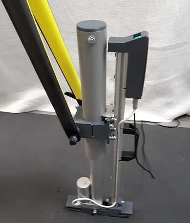
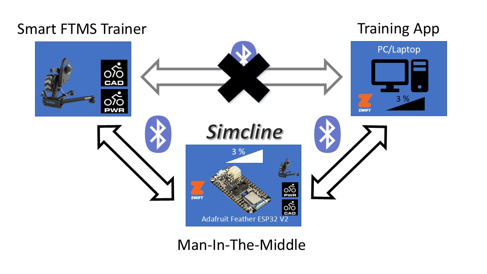
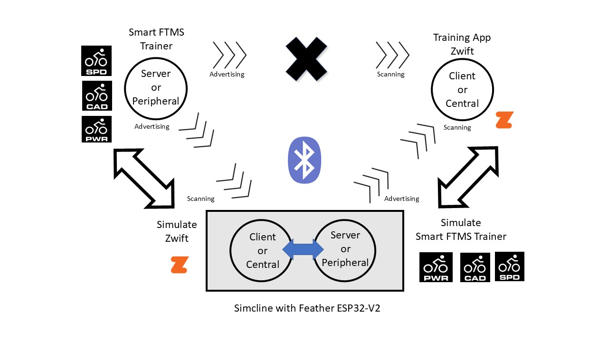

#  &nbsp; SIMCLINE-V2 for Bluetooth Smart FTMS Trainers
# Simulation of Changing Road Inclination for Indoor Cycling<br>

The SIMCLINE physically adjusts the bike position to mimic hilly roads, climbing and descending. This allows the rider to naturally change position on the bike, engage climbing muscles, and improve pedaling technique to become a more efficient and powerful climber.<br>
Without user intervention the SIMCLINE will replicate inclines and declines depicted in (online & offline) training programs (like <b>Zwift, Rouvy, VeloReality, myWhoosh</b> and many others) that adjust accordingly the resistance of the indoor trainer.<br>
The SIMCLINE auto connects at power up with a Bluetooth Smart FTMS trainer and let's relive the ascents and descents from favorite rides or routes while training indoors.<br>
The physical reach is: 20% maximum incline and -10% maximum decline. However, the reach that the rider is comfortable with can be adjusted!<br>
The SIMCLINE pairs directly to the Bluetooth Smart FTMS trainer and with your PC/Laptop/Tablet with (Zwift) training App for a connection that notifies the SIMCLINE to simulate autonomous the (change in) physical grade of the road during an indoor ride. During operation an OLED display shows the road grade in digits and in graphics. The SIMCLINE Companion App (for Android smartphones) can be paired, only when the training App is disconnected, for adjusting operational settings, like Ascent Grade Limit (between 0-20%), Descent Grade Limit (between 0-10%), Road Grade Change Factor (between 0-100%) and manual Up and Down control.<br clear="left"> 
<br>
Notice that the description on how to build SIMCLINE consists of two parts:

+ <b>Mechanical SIMCLINE 2.0</b><br>
 &nbsp; [SIMCLINE 2.0 Instructables](https://www.instructables.com/SIMCLINE-20-Easy-Simulation-of-Road-Incline/) 
<br clear="left">

+ <b>Simcline-V2 Library</b><br>
The present Github repository

# Simcline-V2 Library is optimised for ESP32 and NimBLE-Arduino 2!<br>
The <b>ESP32</b> family has a series of low-cost and low-power System on a Chip (SoC) microcontrollers developed by Espressif that include Wi-Fi and Bluetooth wireless capabilities and dual-core processor. See for an introduction: [Random Nerds Tutorials](https://randomnerdtutorials.com/getting-started-with-esp32/). Particularly the multiprocessing capabilities of the dual-core processor make the ESP32 a very attractive choice for the project!
To benefit of the same formfactor (fit with the Mechanical SIMCLINE 2.0 component box!), I used the [Adafruit Feather ESP32 V2](https://github.com/Berg0162/Simcline-V2/blob/main/docs/Adafruit%20Feather%20ESP32-V2.md) board. Notice that other members of the ESP32 (particularly <b>ESP32S3</b>) will do the job perfectly, when the development boards come with extra flash and psram memory! For example SIMCLINE works successfully with the [Lilygo esp32s3 T-Display](https://github.com/Berg0162/Simcline-V2/blob/main/docs/LILYGO%20ESP32S3%20T-Display.md), however that Lilygo-board needs another size component box!
Simcline-V2 library builds on the knowledge and code of my earlier Simcline projects. The original Simcline code has been redesigned completely and was transformed to a C++ Object model that handles the many BLE services and hides most of the Simcline's operation. The Simcline-V2 design separates completely:
+ presentation (display types/properties)
+ specific ESP32 board properties (pinout and initialization)
+ BLE operation

To achieve this the design has implemented Abstract Base Classes for ESP32 board and Display. As a consequence the naive user only has to change config settings to select between existing board- and display-types. However, a proficient user (with coding skills) can implement Concrete Classes for ESP32-board-type and Display-type of his/her choice easily without interfering with the Simcline BLE operational code.
Benefits of this Approach
+ Scalability: Easily add new display types by creating new concrete classes implementing the IDisplay interface.
+ Maintainability: Changes to one display type do not affect others.
+ Flexibility: Change the display type used by the Presentation class without modifying its implementation.

As a result the Arduino ino-files that the user will access, compile and upload are very concise. All settings have been gathered in one config directory (../documents/arduino/libaries/Simcline-V2/src/config) for Board-, Debug-, Display-, NimBLE- and Simcline-configurations.<br>
The Simcline project heavily leans on the <b>NimBLE-Arduino</b> library for Bluetooth handling, see: [Github:H2Zero/NimBE-Arduino](https://github.com/h2zero/NimBLE-Arduino). <b>NimBLE-Arduino</b> is structured for compilation with Arduino and for use with ESP32! Simcline-V2 works only (!) with the latest version: <b>NimBLE-Arduino Version 2</b>!<br>

# FiTness Machine Service a Bluetooth Service Specification
From 2015 to 2017 the Sports and Fitness Working Group (SIG) designed a Bluetooth Service specification. This service exposes training-related data in the sports and fitness environment, which allows a Server (e.g., a fitness machine) to send training-related data to a Client. In Februari 2017 the service specification reached a stable version: [Fitness Machine Service 1.0](https://www.bluetooth.com/specifications/specs/fitness-machine-service-1-0/) when it was adopted by the Bluetooth SIG Board of Directors. Have a look at the document to appreciate the effort of all the contributors and the companies they represented!<br>
<b>FTMS</b> is an open (nonproprietary) protocol that is not owned by any particular company and not limited to a particular company's product. It can be compared in that respect with FE-C over ANT+, however <b>FTMS</b> is targeted to control fitness equipment over <b>Bluetooth</b>! Today Bluetooth Smart FTMS is the absolute industry standard for indoor trainers!<br>
|Trainer  |Supported protocols|
|-----------|-------------------------------------------------------------------------------------| 
|Elite |ANT+ FE-C and Bluetooth Smart FTMS on all 2020 smart trainers.|
|Gravat |ANT+ FE-C and Bluetooth Smart FTMS on all 2020 smart trainers|
|JetBlack |ANT+ FE-C and Bluetooth Smart FTMS on all 2020 smart trainers.|
|Kinetic |ANT+ FE-C and Bluetooth Smart FTMS on all 2020 smart trainers.|
|Minoura |ANT+ FE-C and Bluetooth Smart FTMS on all 2020 smart trainers.|
|Saris |ANT+ FE-C and Bluetooth Smart FTMS on all 2020 smart trainers.|
|STAC |ANT+ FE-C and Bluetooth Smart FTMS on all 2020 smart trainers.|
|Tacx |ANT+ FE-C on all ‘Smart’ branded trainers (except Satori). Bluetooth Smart FTMS on all post-2021 direct drive models.|
|Wahoo |ANT+ FE-C on all smart trainers, proprietary Wahoo Bluetooth Smart Control and all post-2020 models have Bluetooth Smart FTMS.|
|Zwift|ANT+ FE-C and Bluetooth Smart FTMS on Zwift Hub smart trainer.|

# Man-In-The-Middle (MITM) software pattern<br>
<br>
<b>Man-In-The-Middle</b> is a powerful software engineering pattern that is applied in many software designs. Unfortunately it is also known for a negative application in communication traffic: MITM is a common type of cybersecurity attack that allows attackers to eavesdrop on the communication between two targets.
We have applied the very principle: the Simcline is strategicly positioned in between the BLE communication of the Bluetooth Smart FTMS Trainer and the training App (like Zwift) running on the PC/Laptop, all communication traffic can be inspected in that MITM position, when it is passed on from one to the other, in both directions. When Zwift sends resistance information (like the road inclination) to the Bluetooth Smart FTMS trainer, this information can be intercepted and applied to determine the up/down positioning of the Simcline. <br>

# How to start?<br>
+ Install the [Arduino IDE 2](https://www.arduino.cc/en/Main/Software) and all the libraries on a PC/Mac.
+ Install your ESP32 board in the Arduino environment
+ download the ESP32 NimBLE-Arduino library (<b>Latest Version 2.#.#</b>), see [Arduino Installation NimBLE](https://github.com/h2zero/NimBLE-Arduino#arduino-installation)
+ Download the Simcline-V2 library from [Github](https://github.com/Berg0162/Simcline-V2/tree/master/Simcline-V2) and install the library in the Arduino IDE following the rules that apply to this. <br>

# How to make it work?<br>
The requirements in this phase are simple: 
+ running Zwift, Rouvy or myWhoosh app or alike, 
+ working Feather ESP32-V2 (or other ESP32S3) development board and 
+ working Bluetooth Smart FTMS Trainer
+ running Simcline-V2 library application.<br>

# Testing is Knowing!<br>
I can understand and respect that you have some reserve: Is this really working in my situation? Better test if it is working, before buying all components and start building.
In the Simcline-V2 Library <b>Examples</b> section (see <b>..documents/arduino/libraries/Simcline-V2/examples</b>) you will find the appropriate applications for testing and running SIMCLINE that come with the library. The one you should start with in this stage is <b>FTMS-MITM</b> It is developed with the only intention to allow you to check if the MITM solution is delivering in your specific situation. Within the Arduino IDE 2 select on the top bar menu: File > Examples > Simcline-V2 > FTMS-MITM<br>

<b>What it does in short:</b><br>
<br>
A working <b>MITM</b> implementation links a bike trainer (BLE Server FTMS) and a PC/Laptop (BLE Client running Zwift) with the Feather ESP32, like a <b>bridge</b> in between. The MITM bridge can pass on, control, filter and alter the interchanged trafic data! The <b>MITM</b> code is fully ignorant of mechanical or electronic components that drive the Simcline construction.<br>
```
It simply estabishes a virtual BLE bridge and allows you to ride the bike on the Bluetooth Smart FTMS Trainer and 
feel the resistance that comes with the route you have choosen, thanks to Zwift.
The experience should not differ from a normal direct one-to-one connection, Zwift - Bluetooth Smart FTMS Trainer!
```
All Bluetooth Smart FTMS indoor trainers expose your efforts on the bike in 2 additional BLE services: Cyling Power (CPS) and Speed & Cadence (CSC). These services are detected and applied by many training app's and are therefore an integral part of the present design of the MITM bridge. Training app's simply expect, when they connect to the Bluetooth Smart FTMS trainer, that the CPS and CSC services are available in one go! The Zwift pairing screen is a good example: it expects Power Souce (CPS), Resistance (FTMS) and Cadence (CSC) to be connected...
+ The client-side (Feather ESP32) scans for (a trainer) and connects with <b>FTMS, CPS and optional CSC</b> and collects cyling power, speed and cadence data like Zwift would do! The <b>Simcline Client</b> is doing just that at the left side of the "bridge"!
+ The Server-side (Feather ESP32) advertises and enables connection with training/cycling/game apps like Zwift and collects relevant resistance data, it simulates as if an active <b>FTMS</b> enabled trainer is connected to Zwift or alike! Notice that the Server-side also exposes active <b>CPS</b> and <b>CSC</b> services. The <b>Simcline Server</b> is doing just at the right side of the "bridge"!
+ The <b>Simcline MITM</b> code is connecting both sides at the same time: a full-blown working bridge<br clear="left">

# Load FTMS-MITM application
The default Simcline-V2 configuration settings for FTMS-MITM are: 
+ Display: <b>None</b>
+ ESP32 board: <b>Default</b>
+ NimBLE: <b>FTMS</b> and <b>CSC</b>
+ Debug:  <b>On</b>
  
<b>FTMS-MITM</b> is default in Debug mode: using Serial Monitor (logging on the PC-screen) to show you what is happening!<br>

A recipe for success: follow <b>ALWAYS</b> the usage instructions at the top of the respective program codes!

```
/* -----------------------------------------------------------------------------------------------------
 *             This code should work with all indoor cycling trainers that fully support,
 *        Fitness Machine Service, Cycling Power Service and Cycling Speed & Cadence Service
 * ------------------------------------------------------------------------------------------------------
 * NOTICE: that you need to have set first all config file settings in accordance with your specific setup!
 *         see: ../Documents/Arduino/libraries/FTMS-Simcline/src/config
 *
 *  The code links a BLE Server (a Peripheral to Zwift) and a BLE Client (a Central to the Trainer) with a bridge 
 *  in between, the ESP32 being man-in-the-middle (MITM). The ESP32 is an integral part of the Simcline design,
 *  that interprets the exchanged road grade and moves the front wheel up and down with the change in inclination.
 *  The ESP32-bridge can control, filter and alter the bi-directional interchanged data!
 *  The client-side (central) scans and connects with the Trainer relevant services: CPS and FTMS. It collects 
 *  all cyling data of the services and passes these on to the server-side....  
 *  The client-side supplies the Indoor Trainer with target and resistance control data.
 *  The server-side (peripheral) advertises and enables connection with cycling apps like Zwift and collects the app's  
 *  control commands, target and resistance data. It passes these on to the client-side....  
 *  The server-side supplies the app with the generated cycling data in return. 
 *  
 *  The client plus server (MITM) are transparent to the Indoor Trainer as well as to the training app Zwift or alike!
 *  
 *  Requirements: Zwift app or alike, ESP32 board (NO display required) and a FTMS supporting Indoor Trainer
 *  0) Upload and Run this code on your ESP32 board
 *  1) Start the Serial Monitor to catch debugging info
 *  2) The code will do basic testing of electronic parts and settings
 *  3) Start/Power On the Indoor Trainer  
 *  4) Your ESP32 and Trainer will pair as reported in the output
 *  5) Start Zwift on your computer or tablet and wait....
 *  6) Search on the Zwift pairing screens for your ESP32 a.k.a. <SIM32>
 *  7) Pair: Power Source, Resistance and Cadence one after another with <SIM32>
 *  8) Optionally one can pair as well devices for heartrate and/or steering (Sterzo)
 *  9) Start the default Zwift ride or any ride you wish
 * 10) Make Serial Monitor output window visible on top of the Zwift window 
 * 11) Hop on the bike: do the work and feel resistance change with the road
 * 12) Inspect the info presented by Serial Monitor.....
 *  
 *   This device is identified with the name <SIM32>. You will see this only when connecting to Zwift on the 
 *   pairing screens! Notice: Zwift extends device names with additional numbers for identification!
 *  
*/ 
```
Be aware of undesirebly <b>autoconnect</b> of Zwift with your trainer using ANT+ or BLE FTMS before <b>FTMS-MITM</b> can establish a connection: always start Zwift <b>AFTER</b> FTMS-MITM and trainer have connected successfully! The <b>FTMS-MITM</b> code will than fail to connect, that does not help you getting representative results during the reconnaisance! Only one client can control at the same time: 2 captains on one ship is a recipe for disaster! See for more info [Frequently Asked Questions](https://github.com/Berg0162/Simcline-V2/blob/main/docs/Frequently_Asked_Questions.md)
```
Please write down the MAC/Device Addresses of a) your Bluetooth Smart FTMS trainer and b) your Desktop/Laptop with Zwift.
These are presented in the Serial Monitor log file when running the FTMS-MITM test code. This is for your own convenience
since it helps you to identify later both devices! The FTMS-MITM detects the Mac addresses and stores these in ESP32 NVS
(Non-Volatile-Storage) for later use to unmistakingly establish a BLE connection with the targeted devices.
```


