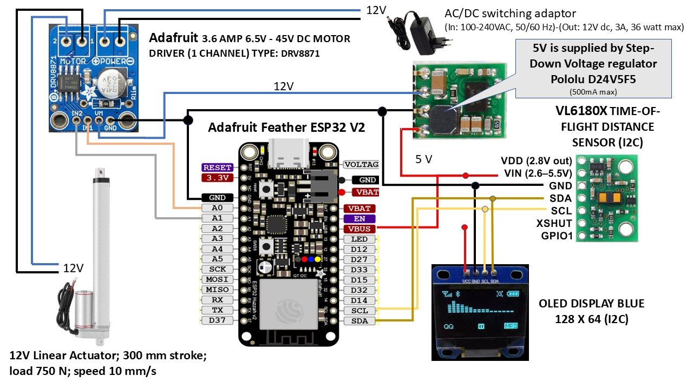

#  &nbsp; SIMCLINE for Bluetooth Smart FTMS trainers

# SIMCLINE 2.0 
See:  [SIMCLINE 2.0 Instructables](https://www.instructables.com/SIMCLINE-20-Easy-Simulation-of-Road-Incline/)
 

# Electronic Components and Circuitry used in version 2.0 

In this project is choosen for the following 5 compact active components that are slightly different from the earlier SIMCLINE project and that can finally all be mounted inside the components box: 

<b>Adafruit DRV8871 DC Motor Driver</b> 
A small one channel motor driver for 12 V (6.5 - 48 V) and 3,6 Amperes max. This board enables the processor to set the Actuator motor in up or down movement. It transforms logical digital levels (Go Up, Go Down and Stop) from the Feather ESP32 to switching of 12 Volt at 3,6 Amperes max., the levels at which the Actuator works. Notice that default the board comes limited to 2,6 Amperes and you need to add a resistor to set for max current level. Install Vertical Through Hole Male PCB Header Pins on the board; this will allow correct mounting of the board inside the components box! 

<b>Adafruit HUZZAH32 ESP32 Feather V2</b> 
During a few years now we have gained a lot of experience with the very stable and reliable <b>Adafruit HUZZAH32 ESP32 Feather V2</b> - with onboard the fabulous ESP32 WROOM module. The ESP32 has both WiFi and Bluetooth Classic/LE support. The new HUZZAH32 V2 is Adafruit's redesigned ESP32-based Feather V2. Compared to the original Feather with only 4 MB Flash and no PSRAM, the V2 has 8 MB Flash and 2 MB PSRAM. Packed with everything people love about Feathers: built in USB-to-Serial converter, automatic bootloader reset, Lithium Ion/Polymer charger, and just about all of the GPIOs brought out.  [Adafruit Feather ESP32 V2](https://learn.adafruit.com/adafruit-esp32-feather-v2)

<b>OLED display blue/white 128x64 pixels (0,96 Inch, I2C)</b> 
Small display board has a critical overall board size of 25 mm * 27 mm (!); (See for example: [Webshop](https://www.pcboard.ca/oled-128x64)). Display area itself is: 25 mm x 14 mm. Shows cycling data and diagnostic info that is gathered during operation by the Feather ESP32 to inform the SIMCLINE user about relevant information. NOTICE: a) Many different formfactors are offered at webshops; b) Install Vertical Through Hole Male PCB Header Pins on the board; this will allow correct mounting of the board inside the components box! 

<b>Pololu Time-of-Flight-Distance sensor VL6180X</b>  The sensor board (12.7 * 17.8 mm) contains a very tiny laser source, and a matching sensor. The VL6180X can detect the "time of flight", or how long the laser light has taken to bounce back to the sensor. Since it uses a very narrow light source, it is perfect for determining distance of only the surface directly in front of it. The sensor registers quite accurately the (change in) position of the wheel axle during operation, by measuring the distance between the top of the inner frame and the reflection plate that is mounted on the carriage. The distance feedback of the sensor is crucial for determining how to set the position of the carriage and axle in accordance with the grade information that for example Zwift is using to set the resistance of the trainer. NOTICE: a) VL6180X boards are also offered by different suppliers and have different formfactors; b) Install Straight Angle Through Hole Male PCB Header Pins on the board; this will allow later flat mounting of the sensor board in the components box! 

<b>Pololu D24V5F5</b> 
This is a small 5V, 500mA Step-Down Voltage Regulator that is responsible for voltage conversion from 12V to 5V, the power supply for all components boards. NOTICE: Install Straight Angle Through Hole Male PCB Header Pins on the board; this will allow later easy mounting of the sensor board in the components box! 

All components are documented very well and are low cost. There are lots of examples for use in an Arduino environment. They have turned out to be very reliable. The exact wiring of the components can be followed in the figure above. 
