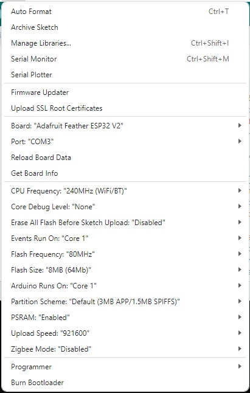

# [1] 
# Who is in control? 
+ When a training app (like Zwift on your laptop) has connected to your trainer using the FTMS protocol: is it possible to connect multiple devices via FTMS? As FTMS enables control of a physical device there can only be one <b>“controller”</b> to avoid safety issues. This means that you will not be able to connect multiple devices directly to the indoor bike trainer or treadmill using FTMS. If the trainer does not appear in an app’s (e.g. Zwift's) device list (on the Zwift pairing screen) it generally means the trainer is (still) connected to another controlling app or device. It is virtually impossible to connect the trainer to Zwift using FTMS, have a nice indoor ride and at the same time to connect for example the Simcline to the trainer or Zwift for simulating road incline... This means that other active cycling App's (installed on your telephone and/or tablet) are in competition with your Zwift App on the latop to connect with the trainer! Be carefull with devices with active cycling Apps near your setup during the connection phase! Notice that modern smartphones are notorious jammers that have a BLE reach of 6-10 meters!

# What about ANT+ (FE-C) and FTMS at the same time? 
+ When a training app (like Zwift) has connected to your trainer using the ANT+ protocol: is it possible to connect other devices via FTMS? 
Since this ANT+ connection enables control of the physical device (trainer) there can NOT be connected another <b>“controller”</b> at the same time over FTMS to avoid safety issues. Only one (1) controlling app is allowed to connect and drive the Trainer at any time. You know, 2 captains on one ship is a recipe for disaster!
If this case, unfortunately and undesirebly, happens with your equipment setup, the controlling Client-side code will not connect or disconnect with an error message! So keep these worlds separated! If you intend to use devices with BLE and FTMS: mechanically disconnect the ANT+ dongle to avoid your controller App (like Zwift) to (auto)connect over ANT+.

# Zwift Hub and Jetblack users 
There is an excellent review available [DCRainmaker Zwift Hub review](https://www.dcrainmaker.com/2022/10/zwift-hub-smart-trainer-in-depth-review-the-best-bang-for-your-buck.html), that describes o.a. a special goodie that comes with the Zwift Hub and Jetblack:
>**– Protocol Compatibility:** ANT+ FE-C, ANT+ Power, Bluetooth Smart Trainer Control, Bluetooth Smart Power (everything you need) 
**– Unique Party Trick: Can rebroadcast your heart rate sensor within a single channel, ideal for Apple TV Zwift users (who are Bluetooth channel limited)** 
**– App Compatibility:** Every app out there basically (Zwift, TrainerRoad, Rouvy, RGT, The Sufferfest, Kinomap, etc…) 

Simcline-V2 **fully** supports this proprietary Zwift function for your heart rate sensor connection. The code supports the same features as you would have had with only Zwift App connected to Zwift Hub or JetBlack trainer! Use your heart rate band the way you are used too before the Simcline-V2 came in between your Zwift Hub/Jetblack trainer and the Zwift App! It should be fully transparent with respect to this feature! Please test yourself!

# Cleanup Zwift devices from the past 
Zwift can sometimes hang onto the wrong info, such as trainers or sensors that were paired to the game in the past. Zwift uses Mac Addresses from previous connections to identify devices. So when device names change Zwift hangs on to the unique Mac Addresses rather than the names that you see in the pairing screens! This can be rather confusing and lead to misunderstandings when you connect devices having only their original names shown and not the actual names.... 
Check out the steps below. 
For <b>PC/Mac</b> to reset all the Zwift stored devices on a PC or Mac, complete these steps:
+ Close Zwift
+ On your desktop, open Documents
+ Double-click Zwift
+ Delete knowndevices.xml 

Next time you go for a Zwift ride:
+ Launch Zwift
+ Pair your devices
 
# Dual Processor use with ESP32
 One of the advantages of the ESP32 platform is the fact that the ESP32 WROOM processor has two cores. This makes it possible to precisely balance the load of a program over 2 processor cores. With the Simcline this is particular usefull for the motor control of the actuator. During operation Zwift sends from time to time new settings, and one of these is the grade value (road inclination in degrees). The program translates the grade to a level that should be reached by the actuator to simulate exactly the road grade that was received from Zwift. However, the actuator can only be switched to <b>move up</b>, <b>move down</b> or <b>stop</b>. After  having set the actuator to move (up or down), the program has to check continuously if the actuator has reached the desired level by reading its position with the help of the Time-Of-Flight sensor and act accordingly. Meanwhile the trainer sends your cycling data and the Zwift app has to confirm the receipt of these data. The data sent by Zwift has also to be tranferred to the trainer and also the trainer has to confirm the receipt. Being a MITM means handling a lot of BLE traffic and it does not allow for mistakes!
The load of the Simcline program itself, the BLE handling and the critical control of the actuator is balanced over 2 processor cores on the ESP32 platform.
The following code snippets show how this is achieved for controlling the actuator motor. To avoid conflicts during variable updates (i.c. TargetPosition) a Binary Semaphore scheme is applied to protect <b>task shared variables</b> during an update. 

# Question: Why is my Trainer (Bluetooth Smart FTMS) variably successful in connecting with the Simcline 2.0 (with ESP32 board) and Zwift?
+ <b>Answer</b>: In most cases this behavior can be attributed to <b>NOT</b> following the critical sequence for starting and connecting of Trainer, Simcline and Zwift. 

0) The Start or Initial situation of <b>ALL</b> parties involved is: Laptop/Zwift, Simcline and Trainer are Powered <b>OFF</b>!
1) Trainer Power-ON --> Trainer needs some time (4 seconds?) to settle and start advertising!
2) Power-ON or Reset Simcline (ESP32 board) --> Simcline needs some time to start, test motor functions and start scanning for Trainer!
3) Wait for Simcline and Trainer to connect! 9 Out of 10 times this is immediately successful. If this is NOT the case then Reset Simcline first and wait again for a Simcline-Trainer connection! If this is NOT successful: go back to "Start" after <b>ALL</b> components have been Powered <b>OFF</b> first.
4) Laptop/Zwift Power-ON --> ONLY when Simcline and Trainer have been connected successfully!
5) Wait and wait for the Zwift pairing window to pop-up
6) Click orange POWER SOURCE button and select in the list with devices: ESP32#### (Simcline) --> Close
7) Click orange RESISTANCE button and select in the list with devices: ESP32#### (Simcline) --> Close
8) Click orange CADENCE button and select in the list with devices: ESP32#### (Simcline) --> Close
9) Click orange HEART RATE button and/or CONTROLS buttons and select in the list with devices: your choice --> Close
10) Click orange OK! button, when all the selected devices are conforming your choices and are indicated as <b>CONNECTED</b>!

