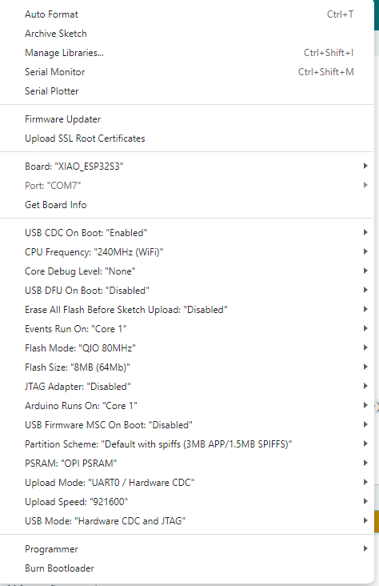
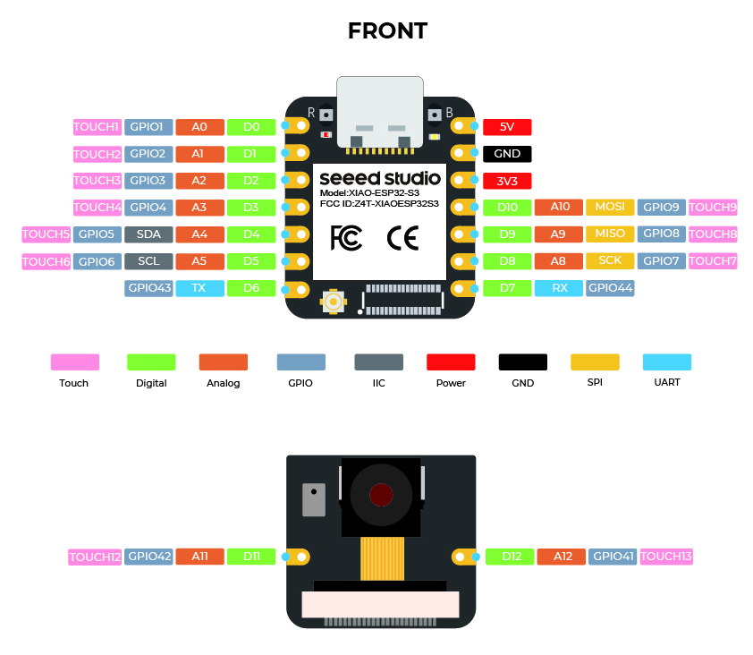
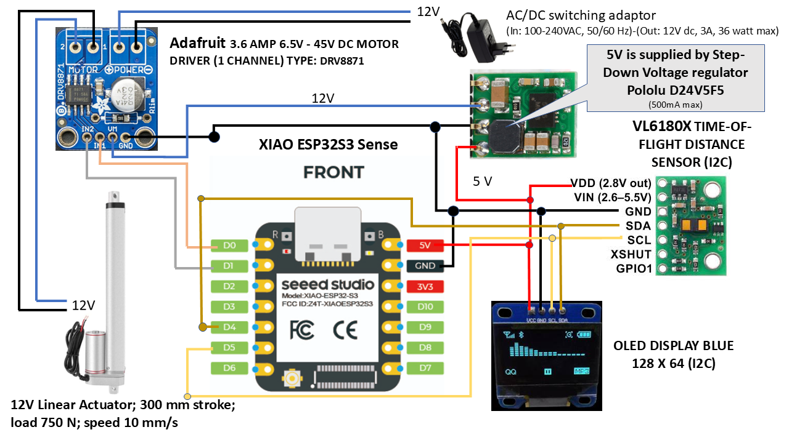

#  &nbsp; SIMCLINE for Bluetooth Smart trainers <br> based on the Seeed Studio XIAO ESP32S3 board with OLED display.

# Setup XIAO ESP32S3 for Simcline-V2
The board and display to work with can be activated in Simcline-V2 with the right settings, see folder: <b>/Simcline-V2/src/config</b><br>
1) Open file, edit and save(!): `/documents/arduino/libraries/Simcline-V2/src/config/configBoard.h`
```C++
// ------------------------------------------------------------------------------------------------
// Define the board here, that is part of your system setup
//#define LILYGO_T_DISPLAY_S3
//#define ADAFRUIT_FEATHER_ESP32_V2
//#define YOUR_ESP32_BOARD
#define XIAO_ESP32S3
```
2) Open file, edit and save(!): `/documents/arduino/libraries/Simcline-V2/src/config/configDisplay.h`<br>
```C++
// ------------------------------------------------------------------------------------------------
// Define the display, that is part of your system setup
//#define NODISPLAY
#define OLEDSSD1306_128x64
//#define LILYGO_T_DISPLAY_S3
//#define YOURDISPLAY
//#define SERIALDISPLAY
// ------------------------------------------------------------------------------------------------
```
<b>Warning</b>: When a new version of Simcline-V2 is installed in Arduino IDE 2 it will override <b>ALL</b> files of a previous version! If you have made modifications in a file that is part of `Simcline-V2` --> <b>Make</b> a <b>copy</b> of the file(s) in question <b>BEFORE</b> you <b>install</b> a new library version!

## Arduino IDE 2.x
The present code is developed on Arduino IDE 2.2. Notice that you will need an Arduino IDE that is tailored for this specific <b>Seeed Studio XIAO ESP32S3</b> processor! Please follow the installation instructions for the [Seeed Studio XIAO ESP32S3](https://wiki.seeedstudio.com/xiao_esp32s3_getting_started/)<br>

## Before you start
If you select in the menu bar of Arduino IDE 2.2 <b>Tools</b>, the settings for the <b>XIAO_ESP32S3</b> processor and the project are the following:
<p align=center>

</p>
<br clear="left">

# XIAO ESP32S3 pinout



# Electronic Components and Wiring for version 2.0<br>


In this setup is chosen for the wellknown 5 compact active components that are used in the SIMCLINE project and that can finally all be mounted inside the components box (designed for use with the Adafruit Feather formfactor). NOTICE: the thump-sized XIAO ESP32S3 needs your special care to be mounted stably inside:<br>

<b>Adafruit DRV8871 DC Motor Driver</b><br>
A small one channel motor driver for 12 V (6.5 - 48 V) and 3,6 Amperes max. This board enables the processor to set the Actuator motor in up or down movement. It transforms logical digital levels (Go Up, Go Down and Stop) from the Feather ESP32 to switching of 12 Volt at 3,6 Amperes max., the levels at which the Actuator works. Notice that default the board comes limited to 2,6 Amperes and you need to add a resistor to set for max current level. Install Vertical Through Hole Male PCB Header Pins on the board; this will allow correct mounting of the board inside the components box!<br>

<b>Seeed Studio XIAO ESP32S3</b><br>
During one year we have gained a lot of experience with the very stable and reliable <b>Seeed Studio XIAO ESP32S3 Sense</b> - in different projects. Without the video camera the board does not need an extra heatsink is my experience!
- Powerful MCU Board: Incorporate the ESP32S3 32-bit, dual-core, Xtensa processor chip operating up to 240 MHz, mounted multiple development ports, Arduino / MicroPython supported
- Advanced Functionality: intergating additional digital microphone (NOT USED)
- Great Memory for more Possibilities: Offer 8MB PSRAM and 8MB FLASH (16MB in Plus version), supporting SD card slot for external 32GB FAT memory (only for XIAO ESP32S3)
- Outstanding RF performance: Support 2.4GHz Wi-Fi and BLE dual wireless communication, support 100m+ remote communication when connected with U.FL antenna
- Thumb-sized Compact Design: 21 x 17.8mm, adopting the classic form factor of XIAO, suitable for space limited projects like wearable devices
[Seeed Studio XIAO ESP32S3](https://wiki.seeedstudio.com/xiao_esp32s3_getting_started/) <br>

<b>OLED display blue/white 128x64 pixels (0,96 Inch, I2C)</b><br>
Small display board has a critical overall board size of 25 mm * 27 mm (!); (See for example: [Webshop](https://www.pcboard.ca/oled-128x64)). Display area itself is: 25 mm x 14 mm. Shows cycling data and diagnostic info that is gathered during operation by the Feather ESP32 to inform the SIMCLINE user about relevant information. NOTICE: a) Many different formfactors are offered at webshops; b) Install Vertical Through Hole Male PCB Header Pins on the board; this will allow correct mounting of the board inside the components box!<br>

<b>Pololu Time-of-Flight-Distance sensor VL6180X</b><br> The sensor board (12.7 * 17.8 mm) contains a very tiny laser source, and a matching sensor. The VL6180X can detect the "time of flight", or how long the laser light has taken to bounce back to the sensor. Since it uses a very narrow light source, it is perfect for determining distance of only the surface directly in front of it. The sensor registers quite accurately the (change in) position of the wheel axle during operation, by measuring the distance between the top of the inner frame and the reflection plate that is mounted on the carriage. The distance feedback of the sensor is crucial for determining how to set the position of the carriage and axle in accordance with the grade information that for example Zwift is using to set the resistance of the trainer. NOTICE: a) VL6180X boards are also offered by different suppliers and have different formfactors; b) Install Straight Angle Through Hole Male PCB Header Pins on the board; this will allow later flat mounting of the sensor board in the components box!<br>

<b>Pololu D24V5F5</b><br>
This is a small 5V, 500mA Step-Down Voltage Regulator that is responsible for voltage conversion from 12V to 5V, the power supply for all components boards. NOTICE: Install Straight Angle Through Hole Male PCB Header Pins on the board; this will allow later easy mounting of the sensor board in the components box!<br>

All components are documented very well and are low cost. There are lots of examples for use in an Arduino environment. They have turned out to be very reliable. The exact wiring of the components can be followed in the figure above.<br>
